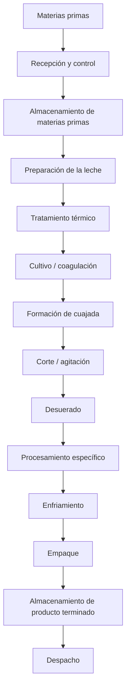
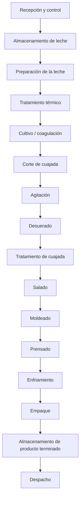
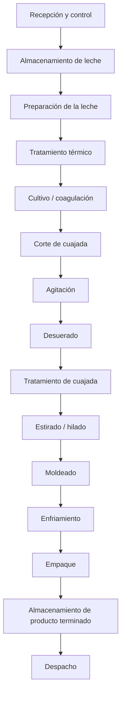
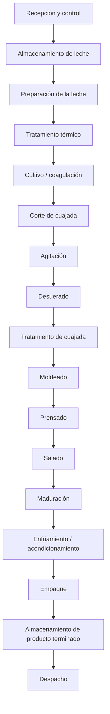
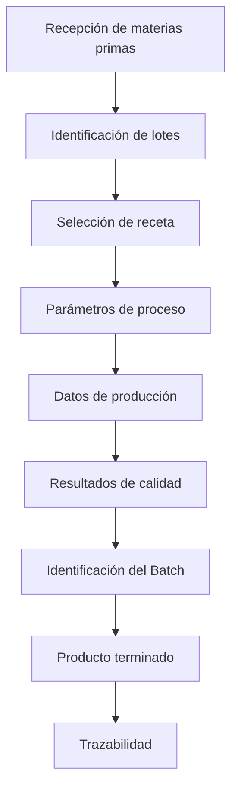
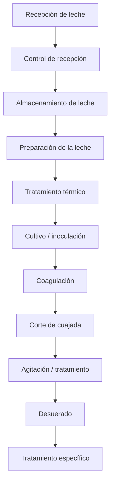
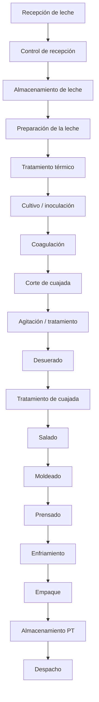
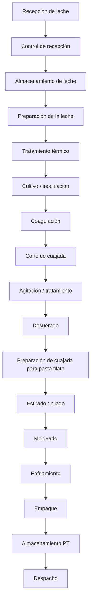
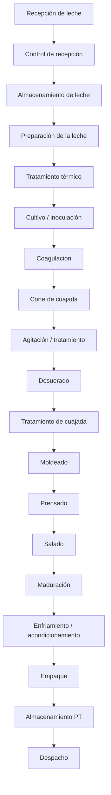

# Línea de Quesos — Modelo TDI

## Información general

**Proyecto:** Transformación Digital Industrial (TDI)
**Empresa de referencia:** Alpina Productos Alimenticios S.A.S.
**Planta de referencia:** Sopó, Cundinamarca, Colombia
**Línea:** Quesos
**Código de línea:** `Q`

> **Nota:** La planta de Sopó se utiliza como referencia del modelo académico. La información interna de Alpina que no sea públicamente verificable no se presenta como dato real de la empresa. En esos casos se utilizarán las etiquetas `REFERENCE`, `ASSUMED`, `CALCULATED` o `PROPOSED`.

---

# Estructura de modelamiento

La línea de quesos se desarrollará utilizando las 12 capas definidas en el estándar general del proyecto:

| Capa | Descripción            | Estado           |
| ---- | ---------------------- | ---------------- |
| 1    | Contexto               | 🟢 En desarrollo |
| 2    | Materias primas        | 🟢 En desarrollo |
| 3    | Flujo general          | ⚪ Pendiente      |
| 4    | Proceso detallado      | ⚪ Pendiente      |
| 5    | Equipos                | ⚪ Pendiente      |
| 6    | Variables              | ⚪ Pendiente      |
| 7    | Sensores y actuadores  | ⚪ Pendiente      |
| 8    | Tiempos                | ⚪ Pendiente      |
| 9    | Capacidades            | ⚪ Pendiente      |
| 10   | Recursos               | ⚪ Pendiente      |
| 11   | Recetas                | ⚪ Pendiente      |
| 12   | Batches y trazabilidad | ⚪ Pendiente      |

---

# Convenciones

## Origen de los datos

Todos los datos deben identificarse mediante una de las siguientes etiquetas:

| Etiqueta     | Significado                                              |
| ------------ | -------------------------------------------------------- |
| `PUBLIC`     | Información pública verificable de la empresa            |
| `REFERENCE`  | Información proveniente de literatura o fuentes técnicas |
| `ASSUMED`    | Supuesto establecido para el modelo académico            |
| `CALCULATED` | Resultado obtenido mediante cálculo                      |
| `PROPOSED`   | Elemento propuesto por el proyecto                       |

### Regla

> Ningún dato numérico debe aparecer sin indicar unidad + origen/estado.

Ejemplo:

```text
Temperatura de pasteurización: 72 °C — REFERENCE
Capacidad del lote: 500 kg/lote — ASSUMED
Producción diaria: 3.000 kg/día — CALCULATED
```

---

## Sistema de identificación

Todos los elementos de la línea de quesos utilizan el prefijo `Q`.

| Elemento          | Código      |
| ----------------- | ----------- |
| Producto          | `Q-PRD-XXX` |
| Operación         | `Q-OP-XXX`  |
| Equipo            | `Q-EQ-XXX`  |
| Variable          | `Q-VAR-XXX` |
| Sensor            | `Q-SEN-XXX` |
| Actuador          | `Q-ACT-XXX` |
| Receta            | `Q-REC-XXX` |
| Recurso           | `Q-RES-XXX` |
| Materia prima     | `Q-MP-XXX`  |
| Material auxiliar | `Q-MA-XXX`  |

Los elementos compartidos de planta utilizarán el prefijo `PL`.

```text
PL-EQ-XXX  → Equipo compartido
PL-RES-XXX → Recurso compartido
```

Los identificadores son únicos y no deben reutilizarse.

---

# Capa 1 — Contexto

## Empresa

**Alpina Productos Alimenticios S.A.S.**

## Planta de referencia

**Sopó, Cundinamarca, Colombia**

La planta de Sopó se utiliza como referencia para construir el modelo académico de la línea de quesos.

La utilización de esta planta como referencia **no implica que los parámetros internos definidos posteriormente correspondan exactamente a la operación real actual de Alpina**.

## Línea de producción

**Línea:** Producción de quesos
**Código:** `Q`

La línea comprende conceptualmente:

```text
Recepción de materias primas
        ↓
Transformación
        ↓
Producto terminado
        ↓
Almacenamiento
        ↓
Despacho
```

## Productos seleccionados

Se seleccionan tres referencias para representar diferentes características y rutas de procesamiento dentro de la línea:

| ID          | Producto         | Categoría    | Presentación de referencia | Origen/Estado |
| ----------- | ---------------- | ------------ | -------------------------- | ------------- |
| `Q-PRD-001` | Queso Campesino  | Queso fresco | Cuña 250 g                 | `PUBLIC`      |
| `Q-PRD-002` | Queso Mozzarella | Queso fresco | Bloque 250 g               | `PUBLIC`      |
| `Q-PRD-003` | Queso Sopó       | Queso maduro | Cuña 180 g                 | `PUBLIC`      |

### Justificación de selección

La selección busca representar productos con diferencias en:

* procesamiento;
* operaciones;
* parámetros;
* tiempos;
* equipos;
* recetas;
* almacenamiento;
* trazabilidad;
* necesidades de producción.

Conceptualmente:

```text
Queso Campesino
    ↓
Producto fresco
    ↓
Proceso relativamente corto
    ↓
Refrigeración


Queso Mozzarella
    ↓
Producto fresco
    ↓
Procesamiento diferenciado de la cuajada
    ↓
Refrigeración


Queso Sopó
    ↓
Producto maduro
    ↓
Proceso + maduración
    ↓
Almacenamiento/maduración
    ↓
Producto terminado
```

> Estas diferencias representan la lógica de modelamiento del proyecto. La secuencia exacta de fabricación de cada referencia deberá validarse mediante fuentes técnicas y, cuando no exista información pública suficiente, mediante supuestos explícitos.

## Alcance del modelo

### Dentro del alcance

El modelo comprende:

* Materias primas
* Operaciones de transformación
* Equipos
* Variables de proceso
* Sensores
* Actuadores
* Tiempos
* Capacidades
* Recursos
* Recetas
* Batches
* Trazabilidad
* Almacenamiento asociado
* Interacción con recursos compartidos de planta

El límite general del modelo es:

```text
Recepción de materias primas
        ↓
Proceso productivo
        ↓
Producto terminado
        ↓
Almacenamiento
        ↓
Despacho
```

### Fuera del alcance inmediato

No se modelará inicialmente:

* Transporte externo
* Distribución nacional
* Puntos de venta
* Comportamiento del consumidor
* Comercialización
* Cadena logística externa

Estos elementos podrán aparecer posteriormente como contexto del proyecto, pero no forman parte del modelo detallado de la línea.

---

# Capa 2 — Materias primas

## Materias primas principales

La materia prima principal de las tres referencias es la leche.

El proceso de elaboración de queso utiliza, dependiendo del producto, cultivos lácticos, agentes coagulantes y sal, además de posibles auxiliares de proceso.

| ID         | Materia prima / insumo | Unidad | Función                                         | Campesino | Mozzarella | Sopó      | Origen/Estado |
| ---------- | ---------------------- | ------ | ----------------------------------------------- | --------- | ---------- | --------- | ------------- |
| `Q-MP-001` | Leche de vaca          | L      | Materia prima principal                         | ✓         | ✓          | ✓         | `REFERENCE`   |
| `Q-MP-002` | Cultivos lácticos      | kg / L | Fermentación y desarrollo de características    | ✓         | ✓          | ✓         | `REFERENCE`   |
| `Q-MP-003` | Cuajo / coagulante     | kg / L | Coagulación de la leche                         | ✓         | ✓          | ✓         | `REFERENCE`   |
| `Q-MP-004` | Sal / NaCl             | kg     | Salado, sabor y conservación                    | ✓         | ✓          | ✓         | `REFERENCE`   |
| `Q-MP-005` | Cloruro de calcio      | kg / L | Auxiliar de coagulación y firmeza de la cuajada | Pendiente | Pendiente  | Pendiente | `REFERENCE`   |

> El cloruro de calcio se mantiene como posible insumo técnico, pero su utilización específica en cada referencia debe validarse antes de incorporarlo a las recetas.

## `Q-MP-001` — Leche de vaca

La leche constituye la materia prima base de las tres referencias.

**Unidad de modelamiento:** `L`

Características relevantes que posteriormente podrán convertirse en variables de proceso o de calidad:

* Temperatura de recepción
* Acidez
* pH
* Grasa
* Proteína
* Sólidos totales
* Carga microbiológica
* Volumen recibido

Las cantidades por batch todavía no se han definido.

## `Q-MP-002` — Cultivos lácticos

Los cultivos lácticos participan en la acidificación y en el desarrollo de características del queso.

**Unidad provisional:** `kg` o `L`

La cantidad exacta dependerá de:

* Producto
* Tipo de cultivo
* Concentración
* Tamaño del batch
* Condiciones de proceso
* Receta

Por lo tanto, la cantidad se definirá posteriormente en la capa de recetas.

## `Q-MP-003` — Cuajo / coagulante

El cuajo o coagulante produce la coagulación de la leche y permite formar la cuajada.

**Unidad provisional:** `kg` o `L`

La cantidad dependerá de:

* Potencia del coagulante
* Volumen de leche
* Temperatura
* Tiempo de coagulación
* Especificación de la receta

No se establece todavía un valor numérico.

## `Q-MP-004` — Sal / NaCl

La sal participa en:

* Desarrollo del sabor
* Conservación
* Control microbiológico
* Regulación de humedad
* Características finales del queso

**Unidad:** `kg`

La etapa exacta de incorporación dependerá del producto y será definida en el proceso detallado y en las recetas.

## `Q-MP-005` — Cloruro de calcio

El cloruro de calcio se mantiene como un posible auxiliar de proceso para mejorar la formación y firmeza de la cuajada.

**Unidad:** `kg` o `L`

**Origen:** `REFERENCE`

**Estado:** Pendiente de validación por producto.

No se afirmará que Alpina utiliza este insumo en una referencia específica sin evidencia suficiente.

---

# Materiales auxiliares y de empaque

Para efectos del modelo TDI, los materiales de empaque se registrarán separadamente de las materias primas.

| ID         | Material                     | Unidad | Función                       | Origen/Estado |
| ---------- | ---------------------------- | ------ | ----------------------------- | ------------- |
| `Q-MA-001` | Material de empaque primario | unidad | Contener el producto          | `PROPOSED`    |
| `Q-MA-002` | Etiqueta                     | unidad | Identificación y trazabilidad | `PROPOSED`    |
| `Q-MA-003` | Embalaje secundario          | unidad | Agrupación y transporte       | `PROPOSED`    |

Las especificaciones concretas de los materiales de empaque se definirán posteriormente.

---

# Relación Producto → Receta → Batch

La estructura fundamental del modelo será:

```text
PRODUCTO
   ↓
RECETA
   ↓
BATCH
```

## Producto

Representa **qué se fabrica**.

Ejemplo:

```text
Q-PRD-001
Queso Campesino 250 g
```

## Receta

Representa **cómo se fabrica**.

Una receta podrá contener:

* Materias primas
* Cantidades
* Secuencia de operaciones
* Temperaturas
* Tiempos
* Velocidades
* Parámetros de proceso
* Condiciones de operación
* Criterios de calidad

Ejemplo:

```text
Q-REC-001
Receta de Queso Campesino
```

## Batch

Representa una **ejecución concreta del proceso de producción**.

Ejemplo:

```text
Batch ID:
20261005-Q-001-001
```

Información asociada:

```text
Producto: Q-PRD-001
Receta: Q-REC-001
Cantidad: pendiente
Fecha: 05/10/2026
```

Posteriormente, el batch deberá permitir registrar:

* Producto fabricado
* Versión de receta
* Materias primas utilizadas
* Equipos utilizados
* Parámetros reales del proceso
* Condiciones de producción
* Resultados de calidad
* Producto terminado

Esto permitirá construir la trazabilidad digital de la producción.

---

# Datos pendientes de definición

Los siguientes valores **no deben definirse arbitrariamente**. Se establecerán en las siguientes capas mediante referencias, supuestos y cálculos:

* Tamaño de batch
* Cantidad de leche por batch
* Cantidad de cultivos
* Cantidad de cuajo
* Cantidad de sal
* Uso de cloruro de calcio
* Rendimiento de producción
* Pérdidas
* Tiempos de operación
* Temperaturas
* Capacidades
* Equipos específicos
* Recursos requeridos

La secuencia de trabajo será:

```text
Materias primas
      ↓
Recetas
      ↓
Balance de masa
      ↓
Batch
      ↓
Tiempos
      ↓
Capacidades
```

---

# Fuentes iniciales

Las fuentes deben ampliarse a medida que se desarrollen las siguientes capas.

### Alpina — Portafolio de quesos

* https://alpina.com/quesos

### Alpina — Queso Campesino

* https://alpina.com/queso-campesino-alpina-cu-a-250-g

### Alpina — Queso Mozzarella

* https://alpina.com/queso-mozarella-alpina-bloque-250-g

### Alpina — Queso Sopó

* https://alpina.com/quesos/quesos-maduros/queso-sopo

### Referencias técnicas

Las fuentes técnicas sobre elaboración de queso se utilizarán para establecer procesos, materias primas y parámetros cuando la información específica de Alpina no esté disponible públicamente.

---
# Capa 3 — Flujo general

La línea de quesos se modela como un **flujo común con rutas diferenciadas según el producto**. La secuencia general permite identificar las principales etapas de transformación, almacenamiento y despacho. Los parámetros específicos de cada operación se desarrollarán posteriormente en la Capa 4.

## Flujo general de la línea



## Ruta — Queso Campesino



## Ruta — Queso Mozzarella



## Ruta — Queso Sopó



## Entradas

Las principales entradas identificadas para la línea son:

| Tipo                   | Elementos                                                                           |
| ---------------------- | ----------------------------------------------------------------------------------- |
| Materias primas        | Leche, cultivos lácticos, cuajo/coagulante, sal y otros auxiliares                  |
| Materiales de empaque  | Empaque primario, etiquetas y empaque secundario                                    |
| Servicios industriales | Agua, energía eléctrica, refrigeración, vapor y aire comprimido, según la operación |

## Salidas

El proceso genera principalmente:

* **Producto terminado:** queso correspondiente a cada referencia.
* **Suero lácteo:** subproducto generado durante la separación de la cuajada.
* **Residuos y desperdicios:** materiales o producto descartado durante el proceso.
* **Información de producción:** datos asociados a materias primas, parámetros, equipos, calidad y trazabilidad.

El suero será considerado posteriormente en el **balance de masa**, el análisis de aprovechamiento de subproductos y la evaluación de recursos de la planta.

## Flujo de información

El flujo físico se complementa con un flujo de información asociado a cada producción:



Esta estructura permitirá posteriormente relacionar el proceso físico con **sensores, actuadores y sistemas digitales** como SCADA, MES y ERP.

## Puntos de almacenamiento identificados

| Punto                                   | Función                                        | Estado   |
| --------------------------------------- | ---------------------------------------------- | -------- |
| Almacenamiento de leche                 | Conservación de materia prima                  | PROPOSED |
| Almacenamiento de materiales de empaque | Disponibilidad de materiales                   | PROPOSED |
| Almacenamiento intermedio               | Conservación temporal de productos/intermedios | PROPOSED |
| Cámara de maduración                    | Maduración del Queso Sopó                      | PROPOSED |
| Almacenamiento de producto terminado    | Conservación antes del despacho                | PROPOSED |

Las capacidades, tiempos de permanencia e inventarios asociados se definirán posteriormente.

## Consideraciones del flujo

* La línea presenta una **secuencia base común**, con operaciones específicas dependiendo de la referencia.
* El **Queso Campesino** incorpora salado, moldeado y prensado.
* El **Queso Mozzarella** incorpora la operación de estirado o hilado.
* El **Queso Sopó** incorpora una etapa de maduración.
* El flujo físico y el flujo de información deben mantenerse asociados mediante la identificación de **lotes, recetas y batches**.
* Las rutas representan el **modelo académico propuesto para la línea** y no necesariamente la secuencia interna exacta de producción de Alpina.
* Los parámetros de operación, tiempos, equipos, capacidades y condiciones específicas se definirán en las capas siguientes.

## Relación con las siguientes capas

El flujo definido en esta capa será la base para desarrollar:

**Flujo → Operaciones → Equipos → Variables → Sensores/actuadores → Tiempos → Capacidades → Recursos → Recetas → Batches y trazabilidad**

Por tanto, cada operación identificada en los diagramas deberá poder relacionarse posteriormente con un identificador `Q-OP-XXX` y con los elementos correspondientes del modelo.

## Estado de la capa

| Elemento                 | Estado                           |
| ------------------------ | -------------------------------- |
| Flujo general            | 🟢 Definido                      |
| Rutas por producto       | 🟢 Definidas                     |
| Entradas                 | 🟢 Identificadas                 |
| Salidas                  | 🟢 Identificadas                 |
| Flujo de información     | 🟢 Definido conceptualmente      |
| Puntos de almacenamiento | 🟡 Identificados preliminarmente |
| Parámetros de proceso    | ⚪ Pendiente — Capa 4             |
| Equipos asociados        | ⚪ Pendiente — Capa 5             |
| Variables                | ⚪ Pendiente — Capa 6             |
| Sensores y actuadores    | ⚪ Pendiente — Capa 7             |
| Tiempos                  | ⚪ Pendiente — Capa 8             |
| Capacidades              | ⚪ Pendiente — Capa 9             |
 
# Capa 4 — Proceso detallado

Esta capa descompone el flujo general de la línea en **operaciones de proceso identificables**, estableciendo sus entradas, salidas y productos asociados.

El modelo se construye a partir de referencias técnicas sobre fabricación de queso y de la clasificación pública de los productos de Alpina. Los parámetros específicos de operación de Alpina no se asumen como información pública; cuando no existe información verificable, el dato se marcará como `ASSUMED` o `PROPOSED`.

La secuencia general de elaboración de queso incluye operaciones como preparación de la leche, tratamiento térmico, acidificación/cultivo, coagulación, corte de la cuajada, separación del suero y tratamiento posterior de la cuajada. La forma específica en que estas operaciones se combinan depende del tipo de queso.

## Process Master

| ID       | Operación                            | Entrada principal            | Salida principal              | Producto         | Origen/Estado |
| -------- | ------------------------------------ | ---------------------------- | ----------------------------- | ---------------- | ------------- |
| Q-OP-001 | Recepción de leche                   | Leche                        | Leche recibida                | Todos            | REFERENCE     |
| Q-OP-002 | Control de recepción                 | Leche recibida               | Leche aprobada/rechazada      | Todos            | REFERENCE     |
| Q-OP-003 | Almacenamiento de leche              | Leche aprobada               | Leche disponible              | Todos            | PROPOSED      |
| Q-OP-004 | Preparación de la leche              | Leche                        | Leche preparada               | Todos            | REFERENCE     |
| Q-OP-005 | Tratamiento térmico                  | Leche preparada              | Leche tratada                 | Todos            | REFERENCE     |
| Q-OP-006 | Cultivo / inoculación                | Leche tratada                | Leche inoculada               | Todos            | REFERENCE     |
| Q-OP-007 | Coagulación                          | Leche inoculada + coagulante | Cuajada                       | Todos            | REFERENCE     |
| Q-OP-008 | Corte de cuajada                     | Cuajada                      | Cuajada cortada + suero       | Todos            | REFERENCE     |
| Q-OP-009 | Agitación / tratamiento de cuajada   | Cuajada cortada              | Cuajada acondicionada + suero | Todos            | REFERENCE     |
| Q-OP-010 | Desuerado                            | Cuajada + suero              | Cuajada + suero separado      | Todos            | REFERENCE     |
| Q-OP-011 | Tratamiento específico de cuajada    | Cuajada                      | Cuajada procesada             | Según producto   | REFERENCE     |
| Q-OP-012 | Salado                               | Cuajada / queso              | Producto salado               | Campesino / Sopó | REFERENCE     |
| Q-OP-013 | Moldeado                             | Cuajada / queso              | Queso moldeado                | Según producto   | REFERENCE     |
| Q-OP-014 | Prensado                             | Queso moldeado               | Queso prensado                | Campesino / Sopó | REFERENCE     |
| Q-OP-015 | Estirado / hilado                    | Cuajada                      | Queso de pasta filata         | Mozzarella       | REFERENCE     |
| Q-OP-016 | Maduración                           | Queso                        | Queso madurado                | Sopó             | REFERENCE     |
| Q-OP-017 | Enfriamiento / acondicionamiento     | Queso procesado              | Queso acondicionado           | Todos            | PROPOSED      |
| Q-OP-018 | Empaque                              | Queso acondicionado          | Producto empacado             | Todos            | PROPOSED      |
| Q-OP-019 | Almacenamiento de producto terminado | Producto empacado            | Producto disponible           | Todos            | PROPOSED      |
| Q-OP-020 | Despacho                             | Producto terminado           | Producto despachado           | Todos            | PROPOSED      |

La secuencia de operaciones se basa en el proceso general de elaboración de queso descrito en literatura técnica; las operaciones específicas de Mozzarella y maduración se diferencian de acuerdo con las características de cada referencia.

## Proceso común

Las operaciones iniciales de la línea se pueden representar como:



La coagulación transforma la leche en una estructura de cuajada y, posteriormente, el corte facilita la separación del suero. El cultivo y las condiciones de procesamiento influyen sobre la humedad, textura, sabor y características finales del queso.

## Ruta de proceso — Queso Campesino

El Queso Campesino de Alpina está clasificado públicamente como un queso fresco.

Para el modelo académico se establece la siguiente ruta:



**Características de modelamiento:**

* Producto fresco.
* No se incorpora una etapa prolongada de maduración en el modelo.
* El salado, moldeado y prensado se consideran operaciones diferenciadoras de la ruta.
* Los tiempos, temperaturas, presiones y cantidades serán definidos posteriormente.

## Ruta de proceso — Queso Mozzarella

Alpina comercializa actualmente la Mozzarella en diferentes presentaciones y la clasifica como una categoría de queso fresco.

La Mozzarella pertenece al grupo de quesos de tipo *pasta filata*, cuyo proceso incluye una etapa de calentamiento y estirado de la cuajada para desarrollar su estructura característica.

Para el modelo académico:



**Características de modelamiento:**

* La etapa de estirado/hilado es una operación diferenciadora.
* Esta etapa implica tratamiento termo-mecánico de la cuajada.
* La temperatura, humedad, pH, velocidad y condiciones de estirado serán variables relevantes para las capas posteriores.
* No se incorpora una etapa prolongada de maduración en la ruta inicial.

## Ruta de proceso — Queso Sopó

Alpina identifica el Queso Sopó como un queso maduro y describe características que dependen de su punto de maduración.

Para el modelo académico:



**Características de modelamiento:**

* Incluye una etapa de maduración.
* La maduración constituye una etapa diferenciadora respecto a los productos frescos.
* Durante esta etapa serán relevantes variables como temperatura, humedad, tiempo y condiciones ambientales.
* La duración y condiciones exactas de maduración serán definidas posteriormente y no se asumirán como datos internos de Alpina.

## Operaciones y elementos que deberán definirse posteriormente

Cada operación del `Process Master` servirá como referencia para las siguientes capas:

| Capa         | Información derivada del proceso                         |
| ------------ | -------------------------------------------------------- |
| Equipos      | Equipo utilizado en cada operación                       |
| Variables    | Variables físicas y químicas relevantes                  |
| Sensores     | Instrumentación necesaria                                |
| Actuadores   | Elementos utilizados para modificar/controlar el proceso |
| Tiempos      | Duración y tiempo de ciclo                               |
| Capacidades  | Capacidad de equipo, lote y producción                   |
| Recursos     | Personal, materiales y servicios                         |
| Recetas      | Parámetros específicos de cada referencia                |
| Batches      | Ejecución concreta de una receta                         |
| Trazabilidad | Registro de materiales, parámetros y resultados          |

## Estado de la información

| Tipo de información              | Estado                      |
| -------------------------------- | --------------------------- |
| Secuencia general de operaciones | 🟢 Definida                 |
| Operaciones comunes              | 🟢 Definidas                |
| Diferenciación Campesino         | 🟢 Definida preliminarmente |
| Diferenciación Mozzarella        | 🟢 Definida                 |
| Diferenciación Sopó              | 🟢 Definida                 |
| Parámetros de proceso            | ⚪ Pendiente                 |
| Equipos                          | ⚪ Capa 5                    |
| Variables                        | ⚪ Capa 6                    |
| Sensores y actuadores            | ⚪ Capa 7                    |
| Tiempos                          | ⚪ Capa 8                    |
| Capacidades                      | ⚪ Capa 9                    |

> **Nota metodológica:** Las secuencias anteriores representan el modelo académico de la línea de quesos. Las fuentes técnicas permiten establecer operaciones características de la elaboración de queso, pero no permiten inferir automáticamente los procedimientos internos específicos de Alpina. Por ello, los parámetros industriales específicos deberán clasificarse como `PUBLIC`, `REFERENCE`, `ASSUMED`, `CALCULATED` o `PROPOSED` según corresponda.

 

